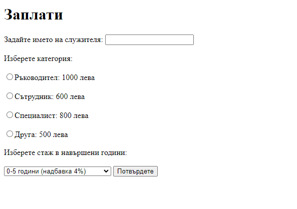
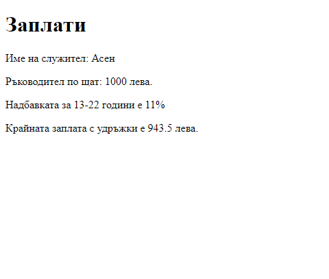

# salary-php
Да се създаде Интернет приложение за изчисляване на крайната заплата на един служител чрез избор от категориите:
| Категория          | Заплата по щат в лева |
|--------------------|-----------------------|
| ръководна длъжност | 1000                  |
| сътрудник          | 600                   |
| специалист         | 750                   |
| друга категория    | 500                   |

1/ Надбавка за клас върху щатната заплата според въведен стаж в навършени години:

| Стаж в навършени години | Надбавка в % |
|-------------------------|--------------|
| 0 – 5 години            | 4            |
| 6 – 12 години           | 7            |
| 13 – 22 години          | 11           |
| Над 22 години           | 16           |

2/ Удръжки: 10 % плосък данък и 5 % за здравно осигуряване от сумата за щатна заплата и надбавка. Да се изведат избраните категории и крайната заплата.

 Забележка: Примерен изглед за постановката и решението на задачата:

